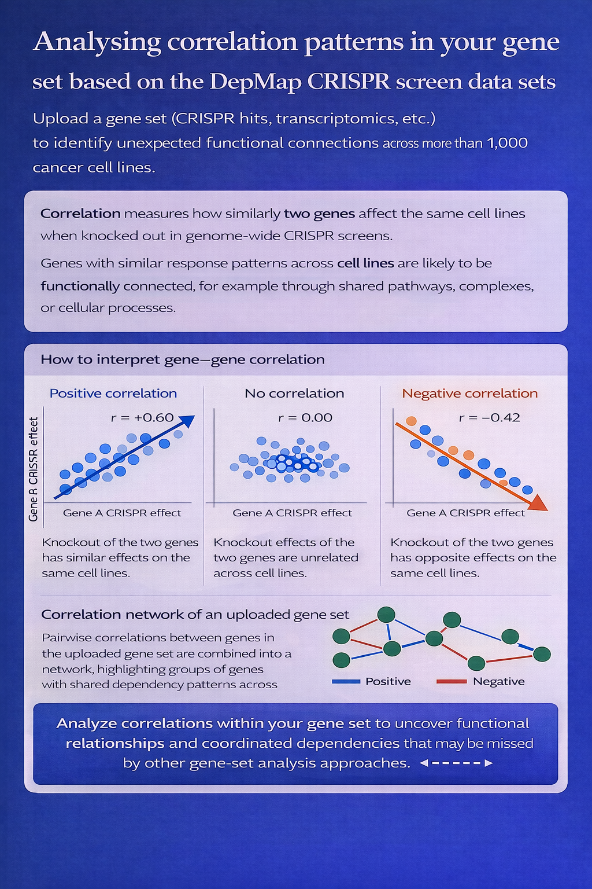

# Gene Correlation Explorer

An R Shiny app for analyzing gene-gene correlations in DepMap CRISPR screen data.



## Data Requirements

This app requires data files from the [DepMap Portal](https://depmap.org/portal/data_page/?tab=allData). Download the following files:

### Required Files

| File | Description |
|------|-------------|
| **CRISPRGeneEffect.csv** | CRISPR gene effect scores (~450MB) |
| **Model.csv** | Cell line metadata including cancer types |

### Optional Files

| File | Description |
|------|-------------|
| **OmicsSomaticMutationsMatrixHotspot.csv** | Mutation data for mutation overlay feature |

### Included in This Repository

| File | Description |
|------|-------------|
| **ortholog_lookup_best.csv** | Human-mouse ortholog mapping table |

### Optional User Data

You can upload your own gene statistics (LFC/FDR values) from your experiments to overlay on the correlation plots. The file should be a CSV with columns for gene symbol, log fold change, and FDR.

## Installation

### 1. Install R and RStudio

If not already installed:
- R: https://cran.r-project.org/
- RStudio: https://posit.co/download/rstudio-desktop/

### 2. Run the App

Required R packages will be installed automatically on first run.

## Usage

### Running the App

**Option 1: From RStudio**
1. Open `app.R` in RStudio
2. Click the "Run App" button in the top right of the editor

**Option 2: From R Console**
```r
shiny::runApp("/path/to/correlation-app")
```

**Option 3: From Terminal**
```bash
Rscript -e "shiny::runApp('/path/to/correlation-app')"
```

### Getting Started

1. **Load Reference Data**: Upload the DepMap files (CRISPRGeneEffect.csv, Model.csv, and optionally the mutation matrix)
2. **Select Genes**: Enter gene symbols for X and Y axes to explore their correlation
3. **Explore**: View scatter plots, filter by cancer type, overlay mutations, and download results

## Credits

- DepMap data: https://depmap.org/
- Wermeling Lab: https://wermelinglab.com/

## License

For research use. Please follow DepMap's terms and conditions when using their data.
